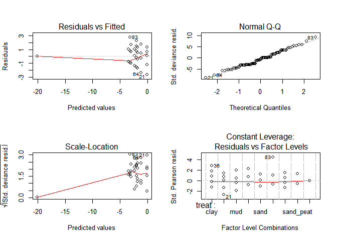
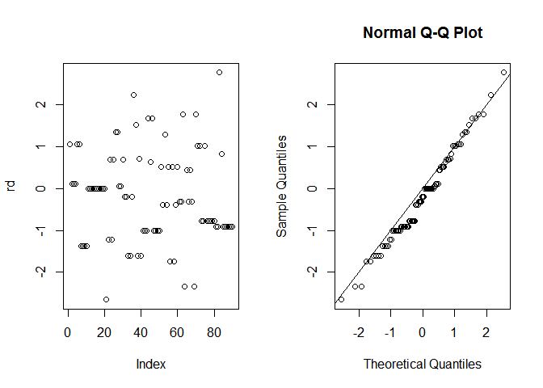
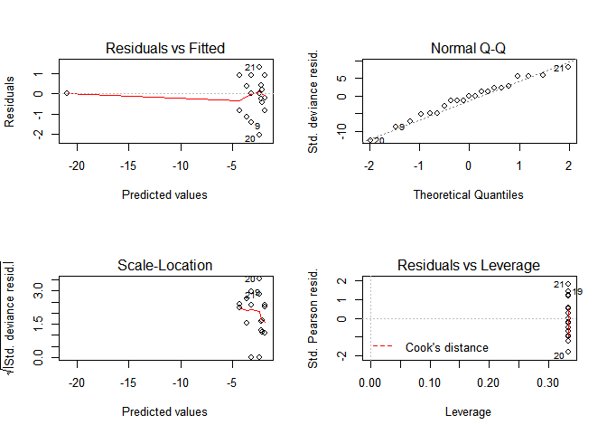
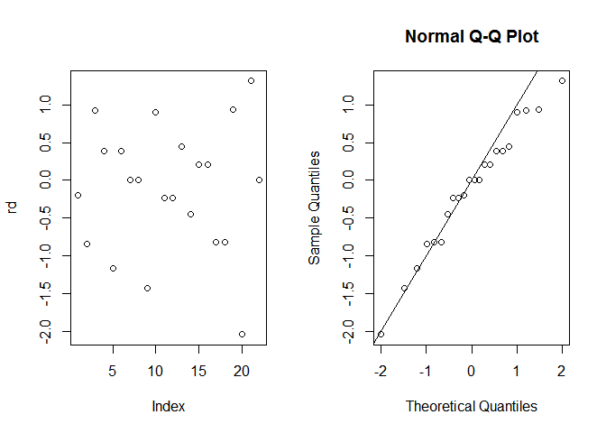
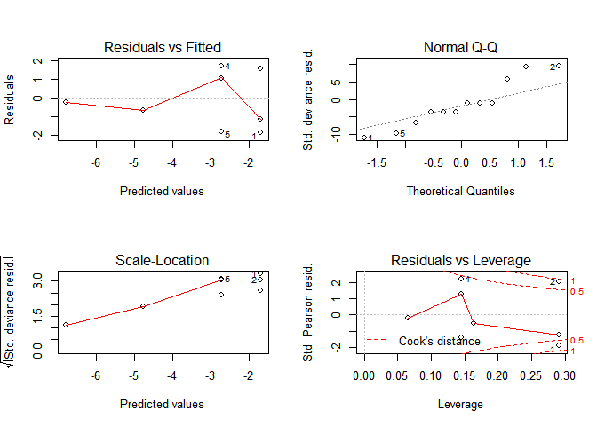
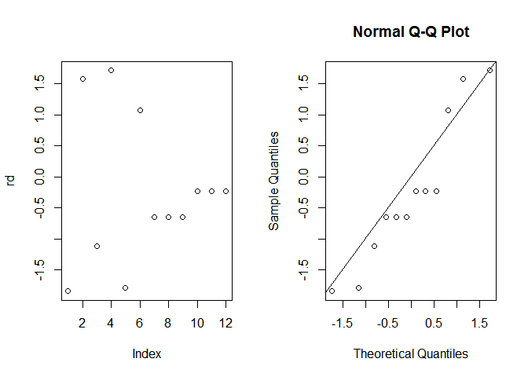
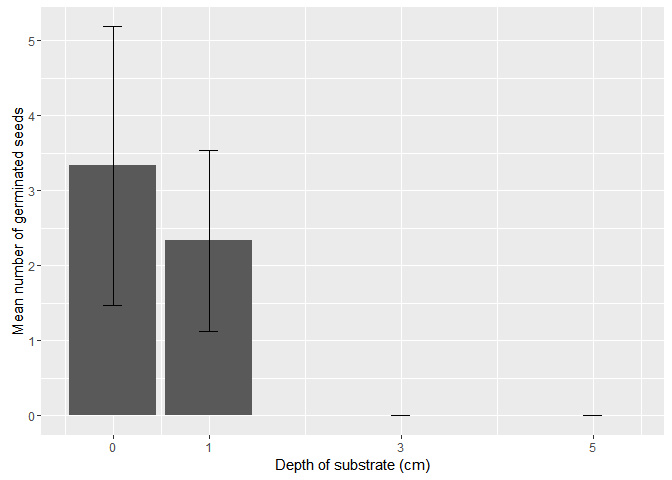
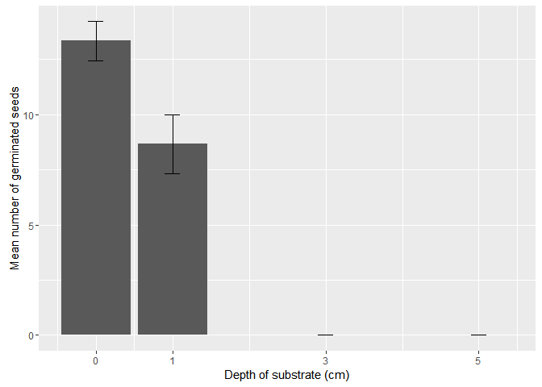

# Littorella uniflora
Pavel Jakubec  
13. února 2016  
# Litorela report  
## Effect of soil type on germination of Litorela uniflora   


### Model:
* succ = number of germinated seeds  
* fail = succ - sum (all seeds)   
* treat = soil type  


```r
data=read.csv ("data/prolicovani_ruzne_substraty_2.csv", header=TRUE, sep=";") 
```

```r
#Binomial GLM model
mod <- glm(cbind(succ, fail) ~ treat, data=data,family=binomial)
mod
```

```
## 
## Call:  glm(formula = cbind(succ, fail) ~ treat, family = binomial, data = data)
## 
## Coefficients:
##    (Intercept)    treatcontrol        treatmud       treatpeat  
##        -1.9924          1.9524          0.8398         -0.9520  
##      treatsand  treatsand_clay   treatsand_mud  treatsand_peat  
##        -0.3212         -1.1856          0.1771         -1.4837  
##   treattopsoil  
##       -18.1260  
## 
## Degrees of Freedom: 89 Total (i.e. Null);  81 Residual
## Null Deviance:	    249.9 
## Residual Deviance: 107 	AIC: 233.1
```

```r
summary(mod)
```

```
## 
## Call:
## glm(formula = cbind(succ, fail) ~ treat, family = binomial, data = data)
## 
## Deviance Residuals: 
##     Min       1Q   Median       3Q      Max  
## -2.6543  -0.9036  -0.1997   0.5192   2.7690  
## 
## Coefficients:
##                 Estimate Std. Error z value Pr(>|z|)    
## (Intercept)      -1.9924     0.3077  -6.475 9.50e-11 ***
## treatcontrol      1.9524     0.3670   5.319 1.04e-07 ***
## treatmud          0.8398     0.3867   2.172   0.0299 *  
## treatpeat        -0.9520     0.5525  -1.723   0.0849 .  
## treatsand        -0.3212     0.4656  -0.690   0.4903    
## treatsand_clay   -1.1856     0.5959  -1.990   0.0466 *  
## treatsand_mud     0.1771     0.4216   0.420   0.6744    
## treatsand_peat   -1.4837     0.6621  -2.241   0.0250 *  
## treattopsoil    -18.1260  1417.4364  -0.013   0.9898    
## ---
## Signif. codes:  0 '***' 0.001 '**' 0.01 '*' 0.05 '.' 0.1 ' ' 1
## 
## (Dispersion parameter for binomial family taken to be 1)
## 
##     Null deviance: 249.93  on 89  degrees of freedom
## Residual deviance: 107.05  on 81  degrees of freedom
## AIC: 233.08
## 
## Number of Fisher Scoring iterations: 17
```

```r
#Testing effect of treatment
anova(mod, test="Ch")
```

```
## Analysis of Deviance Table
## 
## Model: binomial, link: logit
## 
## Response: cbind(succ, fail)
## 
## Terms added sequentially (first to last)
## 
## 
##       Df Deviance Resid. Df Resid. Dev  Pr(>Chi)    
## NULL                     89     249.93              
## treat  8   142.88        81     107.05 < 2.2e-16 ***
## ---
## Signif. codes:  0 '***' 0.001 '**' 0.01 '*' 0.05 '.' 0.1 ' ' 1
```

```r
#Coefficient for each treatment
coef <- coef(mod)
control <- inv.logit(coef[1]+coef[2])
mud <- inv.logit(coef[1]+coef[3])
peat <- inv.logit(coef[1]+coef[4])
sand <- inv.logit(coef[1]+coef[5])
sand_clay <- inv.logit(coef[1]+coef[6])
sand_mud <- inv.logit(coef[1]+coef[7])
sand_peat <- inv.logit(coef[1]+coef[8])
```
### Results  
Effect of soil type is statistically significant.  

### Residuals  
Residuals behave normaly and model is fitting the data well.  

```r
#see what is going on with residuals
par(mfrow=c(2,2))
plot(mod)
```

<!-- -->

```r
par(mfrow=c(1,2))
rd=residuals(mod)
plot(rd)
qqnorm(residuals(mod, type="deviance"))
abline(a=0,b=1)
```

<!-- -->


### Bar plot:   

```r
#summary for ploting
sumary.dev = summarySE (data, 
  measurevar="succ", groupvars="treat")
sumary.dev$succ <- sumary.dev$succ*10
sumary.dev$se <- sumary.dev$se*10
sumary.dev$sd <- sumary.dev$sd*10
sumary.dev$ci <- sumary.dev$ci*10
sumary.dev <- sumary.dev[-(9),]

#Plotting barplot of germination rates on different soils
p = ggplot (sumary.dev, aes (y=succ, x=reorder(treat,succ)))
p2=p + stat_summary(fun.y=mean, geom="bar", position=position_dodge())+
  xlab("Germination substrate")+
  ylab("Mean germination rate (%)")+
  geom_errorbar(aes(ymin=succ-se, ymax=succ+se),
    width=.2,                    # Width of the error bars
    position=position_dodge(.1))
p3=p2+ coord_flip()
label.df1 <- data.frame(treat="control", succ=57)
label.df2 <- data.frame(treat=c("mud", "sand_peat", "sand_clay" ),succ=c(31,5.5,8))
p3+scale_x_discrete(labels=c("Sand+Peat", "Sand+Clay","Peat", "Sand", "Clay", "Sand+Fishpond sediment", "Fishpond sediment", "Control"))+geom_text(data = label.df1, label = "***", nudge_x = -0.1)+geom_text(data=label.df2, label="*", nudge_x = -0.1)
```

<!-- -->

```r
#save the output graph
ggsave("outputs/substrate.tiff",dpi=100, scale=1.5)
```

```
## Saving 10.5 x 7.5 in image
```

### Germination probability (%)   


```r
sumary.dev
```

```
##       treat  N succ        sd       se        ci
## 1      clay 10   12 13.984118 4.422166 10.003635
## 2   control 10   49 19.692074 6.227181 14.086861
## 3       mud 10   24 17.126977 5.416026 12.251901
## 4      peat 10    5  8.498366 2.687419  6.079365
## 5      sand 10    9  8.755950 2.768875  6.263630
## 6 sand_clay 10    4  9.660918 3.055050  6.911004
## 7  sand_mud 10   14  9.660918 3.055050  6.911004
## 8 sand_peat 10    3  4.830459 1.527525  3.455502
```

```r
rm(list=ls())
```
## THE END   

## Effect of place of origin on germination of Littorella uniflora   


### Model:
* succ = number of germinated seeds    
* fail = succ - sum (all seeds)    
* loc = place of origin  

   
### Results
Effect of place of origin is statisticly significant for germination rate of L. uniflora.  

```r
mod <- glm(cbind(succ, fail) ~ loc, data=data,family=binomial)
mod
```

```
## 
## Call:  glm(formula = cbind(succ, fail) ~ loc, family = binomial, data = data)
## 
## Coefficients:
## (Intercept)        lockr        locla        locmr        locno  
##     -3.5973       1.4721       1.1550      -0.7068     -17.3653  
##       locos        locry        locst  
##      1.7255       1.3237       0.4193  
## 
## Degrees of Freedom: 21 Total (i.e. Null);  14 Residual
## Null Deviance:	    33.57 
## Residual Deviance: 14.82 	AIC: 71.65
```

```r
summary(mod)
```

```
## 
## Call:
## glm(formula = cbind(succ, fail) ~ loc, family = binomial, data = data)
## 
## Deviance Residuals: 
##     Min       1Q   Median       3Q      Max  
## -2.0418  -0.7269  -0.0001   0.3858   1.3132  
## 
## Coefficients:
##              Estimate Std. Error z value Pr(>|z|)    
## (Intercept)   -3.5973     0.7167  -5.019 5.19e-07 ***
## lockr          1.4721     0.8085   1.821   0.0686 .  
## locla          1.1550     0.8336   1.386   0.1659    
## locmr         -0.7068     1.2358  -0.572   0.5674    
## locno        -17.3653  4323.6575  -0.004   0.9968    
## locos          1.7255     0.7931   2.176   0.0296 *  
## locry          1.3237     0.8193   1.616   0.1062    
## locst          0.4193     0.9279   0.452   0.6514    
## ---
## Signif. codes:  0 '***' 0.001 '**' 0.01 '*' 0.05 '.' 0.1 ' ' 1
## 
## (Dispersion parameter for binomial family taken to be 1)
## 
##     Null deviance: 33.571  on 21  degrees of freedom
## Residual deviance: 14.816  on 14  degrees of freedom
## AIC: 71.651
## 
## Number of Fisher Scoring iterations: 17
```

```r
anova(mod, test="Ch")
```

```
## Analysis of Deviance Table
## 
## Model: binomial, link: logit
## 
## Response: cbind(succ, fail)
## 
## Terms added sequentially (first to last)
## 
## 
##      Df Deviance Resid. Df Resid. Dev Pr(>Chi)   
## NULL                    21     33.571            
## loc   7   18.755        14     14.816  0.00899 **
## ---
## Signif. codes:  0 '***' 0.001 '**' 0.01 '*' 0.05 '.' 0.1 ' ' 1
```

### Residuals   
Residuals behave normaly therefore model is fitting the data well.   


```r
par(mfrow=c(2,2))
plot(mod)
```

<!-- -->

```r
par(mfrow=c(1,2))
rd=residuals(mod)
plot(rd)
qqnorm(residuals(mod, type="deviance"))
abline(a=0,b=1)
```

<!-- -->


###Bar plot   

```r
sumary.dev = summarySE (data, measurevar="succ", groupvars="loc")
sumary.dev$succ <- sumary.dev$succ/25*100
sumary.dev$se <- sumary.dev$se/25*100
sumary.dev$sd <- sumary.dev$sd/25*100
sumary.dev$ci <- sumary.dev$ci/25*100
sumary.dev <- sumary.dev[-(5),]


p = ggplot (sumary.dev, aes (y=succ, x=reorder(loc, succ)))
p + stat_summary(fun.y=mean, geom="bar", position=position_dodge())+
  xlab("Locality")+
  ylab("Mean germination (%)")+
  geom_errorbar(aes(ymin=succ-se, ymax=succ+se),
    width=.2,                    # Width of the error bars
    position=position_dodge(.9))
```

<!-- -->

```r
#save the output graph
ggsave("outputs/locality.tiff",dpi=100, scale=1.5)
```

```
## Saving 10.5 x 7.5 in image
```
   
### Germination probability (%)   

```r
sumary.dev
```

```
##   loc N      succ       sd       se        ci
## 1  ka 3  2.666667 2.309401 1.333333  5.736870
## 2  kr 3 10.666667 2.309401 1.333333  5.736870
## 3  la 3  8.000000 8.000000 4.618802 19.873102
## 4  mr 3  1.333333 2.309401 1.333333  5.736870
## 6  os 3 13.333333 6.110101 3.527668 15.178332
## 7  ry 3  9.333333 2.309401 1.333333  5.736870
## 8  st 3  4.000000 4.000000 2.309401  9.936551
```

```r
rm(list=ls())
```
   
### THE END  

## Germination under a layer of soil (climabox)   


### Model:   
* succ = number of germinated seeds  
* fail = succ - sum (all seeds)  
* depth = soil layer depth  

   
### Results 
Effect of substrate depth is statistically significant. 

```r
#put together some model
mod <- glm(cbind(succ, fail) ~ depth, data=substr,family=binomial)
mod
```

```
## 
## Call:  glm(formula = cbind(succ, fail) ~ depth, family = binomial, data = substr)
## 
## Coefficients:
## (Intercept)        depth  
##      -1.696       -1.019  
## 
## Degrees of Freedom: 11 Total (i.e. Null);  10 Residual
## Null Deviance:	    38.3 
## Residual Deviance: 15.95 	AIC: 33.88
```

```r
summary(mod)
```

```
## 
## Call:
## glm(formula = cbind(succ, fail) ~ depth, family = binomial, data = substr)
## 
## Deviance Residuals: 
##      Min        1Q    Median        3Q       Max  
## -1.84721  -0.77249  -0.44611   0.09039   1.71574  
## 
## Coefficients:
##             Estimate Std. Error z value Pr(>|z|)    
## (Intercept)  -1.6965     0.2984  -5.685 1.31e-08 ***
## depth        -1.0189     0.3300  -3.088  0.00202 ** 
## ---
## Signif. codes:  0 '***' 0.001 '**' 0.01 '*' 0.05 '.' 0.1 ' ' 1
## 
## (Dispersion parameter for binomial family taken to be 1)
## 
##     Null deviance: 38.304  on 11  degrees of freedom
## Residual deviance: 15.950  on 10  degrees of freedom
## AIC: 33.88
## 
## Number of Fisher Scoring iterations: 6
```

```r
anova(mod, test="Ch")
```

```
## Analysis of Deviance Table
## 
## Model: binomial, link: logit
## 
## Response: cbind(succ, fail)
## 
## Terms added sequentially (first to last)
## 
## 
##       Df Deviance Resid. Df Resid. Dev  Pr(>Chi)    
## NULL                     11     38.304              
## depth  1   22.354        10     15.950 2.268e-06 ***
## ---
## Signif. codes:  0 '***' 0.001 '**' 0.01 '*' 0.05 '.' 0.1 ' ' 1
```
   
### Residuals  
Residuals behave normaly therefore model is fitting the data well.   

```r
#see what is going on with residuals
par(mfrow=c(2,2))
plot(mod)
```

<!-- -->

```r
par(mfrow=c(1,2))
rd=residuals(mod)
plot(rd)
qqnorm(residuals(mod, type="deviance"))
abline(a=0,b=1)
```

<!-- -->
   
### Barplot  
<!-- -->

```
## Saving 10.5 x 7.5 in image
```
   
### Germination probability (%)

```r
sumary.dev
```

```
##   depth N      succ        sd       se       ci
## 1     0 3 13.333333 12.858201 7.423686 31.94154
## 2     1 3  9.333333  8.326664 4.807402 20.68458
## 3     3 3  0.000000  0.000000 0.000000  0.00000
## 4     5 3  0.000000  0.000000 0.000000  0.00000
```

```r
rm(list=ls())
```
   
###THE END   

##Germination under a layer of soil (glasshouse)   


   
### Model:
* y = number of germinated seeds  / number of fails  
* treat = soil layer depth  


```
## [1] 12
```
   
### Results   
Effect of soil depth is statistically significant.  

```r
#put together some model
m1=glm(y~treat, family=binomial)
m1
```

```
## 
## Call:  glm(formula = y ~ treat, family = binomial)
## 
## Coefficients:
## (Intercept)        treat  
##      0.3516      -1.3576  
## 
## Degrees of Freedom: 11 Total (i.e. Null);  10 Residual
## Null Deviance:	    118.4 
## Residual Deviance: 9.667 	AIC: 35.38
```

```r
anova(m1, test="Ch")
```

```
## Analysis of Deviance Table
## 
## Model: binomial, link: logit
## 
## Response: y
## 
## Terms added sequentially (first to last)
## 
## 
##       Df Deviance Resid. Df Resid. Dev  Pr(>Chi)    
## NULL                     11    118.404              
## treat  1   108.74        10      9.667 < 2.2e-16 ***
## ---
## Signif. codes:  0 '***' 0.001 '**' 0.01 '*' 0.05 '.' 0.1 ' ' 1
```

```r
summary(m1)
```

```
## 
## Call:
## glm(formula = y ~ treat, family = binomial)
## 
## Deviance Residuals: 
##     Min       1Q   Median       3Q      Max  
## -1.0936  -1.0812  -0.3000  -0.1792   1.4325  
## 
## Coefficients:
##             Estimate Std. Error z value Pr(>|z|)    
## (Intercept)   0.3516     0.2127   1.653   0.0983 .  
## treat        -1.3576     0.2173  -6.248 4.15e-10 ***
## ---
## Signif. codes:  0 '***' 0.001 '**' 0.01 '*' 0.05 '.' 0.1 ' ' 1
## 
## (Dispersion parameter for binomial family taken to be 1)
## 
##     Null deviance: 118.4043  on 11  degrees of freedom
## Residual deviance:   9.6671  on 10  degrees of freedom
## AIC: 35.382
## 
## Number of Fisher Scoring iterations: 5
```
   
### Residuals   
Residuals behave a bit different than expected, but could be considered normaly distributed.

```r
#see what is going on with residuals
par(mfrow=c(2,2))
plot(m1)
```

<!-- -->

```r
rd=residuals(m1,type = c("deviance"))
par(mfrow=c(1,2))
rd=residuals(m1)
plot(rd)
qqnorm(residuals(m1, type="deviance"))
abline(a=0,b=1)
```

<!-- -->
   
### Barplot
<!-- -->

```
## Saving 10.5 x 7.5 in image
```
   
### Germination probability (%)

```r
sumary.dev
```

```
##   treat N     germ       sd       se       ci
## 1     0 3 53.33333 6.110101 3.527668 15.17833
## 2     1 3 34.66667 9.237604 5.333333 22.94748
## 3     3 3  0.00000 0.000000 0.000000  0.00000
## 4     5 3  0.00000 0.000000 0.000000  0.00000
```

```r
rm(list=ls())
```
