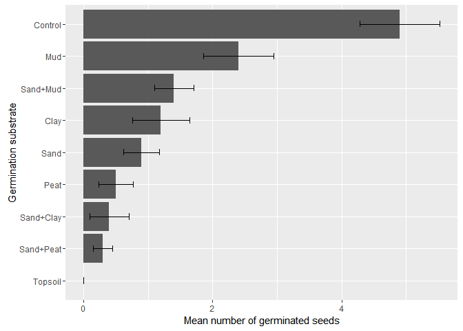
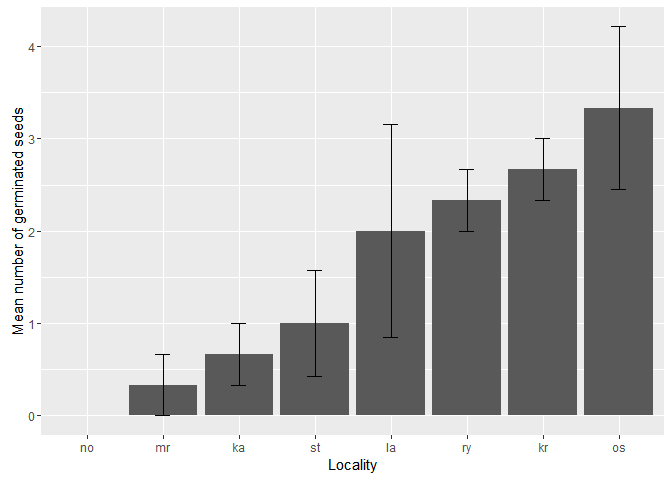
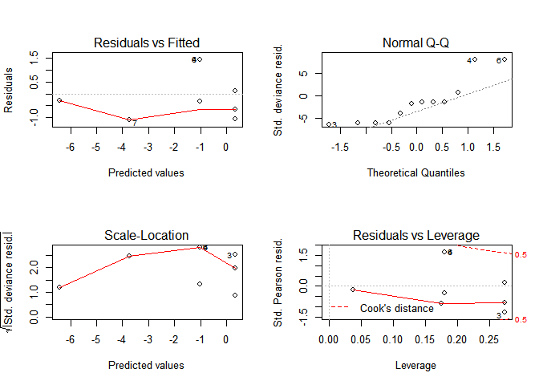
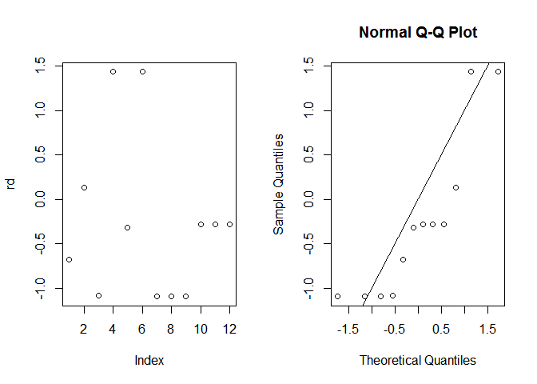

# Litorela
Pavel Jakubec  
13. února 2016  
# Litorela report  
## Effect of soil type on germination of Litorela uniflora   


### Model:
* succ = number of germinated seeds  
* fail = succ - sum (all seeds)   
* treat = soil type   


```r
#put together some model
mod <- glm(cbind(succ, fail) ~ treat, data=data,family=binomial)
mod
```

```
## 
## Call:  glm(formula = cbind(succ, fail) ~ treat, family = binomial, data = data)
## 
## Coefficients:
##    (Intercept)    treatcontrol        treatmud       treatpeat  
##        -1.9924          1.9524          0.8398         -0.9520  
##      treatsand  treatsand_clay   treatsand_mud  treatsand_peat  
##        -0.3212         -1.1856          0.1771         -1.4837  
##   treattopsoil  
##       -18.1260  
## 
## Degrees of Freedom: 89 Total (i.e. Null);  81 Residual
## Null Deviance:	    249.9 
## Residual Deviance: 107 	AIC: 233.1
```

```r
summary(mod)
```

```
## 
## Call:
## glm(formula = cbind(succ, fail) ~ treat, family = binomial, data = data)
## 
## Deviance Residuals: 
##     Min       1Q   Median       3Q      Max  
## -2.6543  -0.9036  -0.1997   0.5192   2.7690  
## 
## Coefficients:
##                 Estimate Std. Error z value Pr(>|z|)    
## (Intercept)      -1.9924     0.3077  -6.475 9.50e-11 ***
## treatcontrol      1.9524     0.3670   5.319 1.04e-07 ***
## treatmud          0.8398     0.3867   2.172   0.0299 *  
## treatpeat        -0.9520     0.5525  -1.723   0.0849 .  
## treatsand        -0.3212     0.4656  -0.690   0.4903    
## treatsand_clay   -1.1856     0.5959  -1.990   0.0466 *  
## treatsand_mud     0.1771     0.4216   0.420   0.6744    
## treatsand_peat   -1.4837     0.6621  -2.241   0.0250 *  
## treattopsoil    -18.1260  1417.4364  -0.013   0.9898    
## ---
## Signif. codes:  0 '***' 0.001 '**' 0.01 '*' 0.05 '.' 0.1 ' ' 1
## 
## (Dispersion parameter for binomial family taken to be 1)
## 
##     Null deviance: 249.93  on 89  degrees of freedom
## Residual deviance: 107.05  on 81  degrees of freedom
## AIC: 233.08
## 
## Number of Fisher Scoring iterations: 17
```

```r
anova(mod, test="Ch")
```

```
## Analysis of Deviance Table
## 
## Model: binomial, link: logit
## 
## Response: cbind(succ, fail)
## 
## Terms added sequentially (first to last)
## 
## 
##       Df Deviance Resid. Df Resid. Dev  Pr(>Chi)    
## NULL                     89     249.93              
## treat  8   142.88        81     107.05 < 2.2e-16 ***
## ---
## Signif. codes:  0 '***' 0.001 '**' 0.01 '*' 0.05 '.' 0.1 ' ' 1
```
### Results  
Vliv pudniho typu je vyznamny.  

### Residuals  
Residua se chovaji pomerne normalne, takze model fituje data dobre.  

```r
#see what is going on with residuals
par(mfrow=c(2,2))
plot(mod)
```


```r
par(mfrow=c(1,2))
rd=residuals(mod)
plot(rd)
qqnorm(residuals(mod, type="deviance"))
abline(a=0,b=1)
```


### Germination probability (%)   


```r
#back-transformation of coeficients for each treatment to mean survival probability
plogis (mod$coefficients[1]) #intercept (clay)
```

```
## (Intercept) 
##        0.12
```

```r
plogis (mod$coefficients[1]+mod$coefficients[2]) #control
```

```
## (Intercept) 
##        0.49
```

```r
plogis (mod$coefficients[1]+mod$coefficients[3]) #mud
```

```
## (Intercept) 
##        0.24
```

```r
plogis (mod$coefficients[1]+mod$coefficients[4]) #peat
```

```
## (Intercept) 
##        0.05
```

```r
plogis (mod$coefficients[1]+mod$coefficients[5]) #sand
```

```
## (Intercept) 
##        0.09
```

```r
plogis (mod$coefficients[1]+mod$coefficients[6]) #sand_clay
```

```
## (Intercept) 
##        0.04
```

```r
plogis (mod$coefficients[1]+mod$coefficients[7]) #sand_mud
```

```
## (Intercept) 
##        0.14
```

```r
plogis (mod$coefficients[1]+mod$coefficients[8]) #sand_peat
```

```
## (Intercept) 
##        0.03
```

```r
plogis (mod$coefficients[1]+mod$coefficients[9]) #topsoil
```

```
##  (Intercept) 
## 1.831042e-09
```
### Bar plot:   


## THE END   

## Effect of place of origin on germination of Litorela uniflora   


### Model:
* succ = number of germinated seeds    
* fail = succ - sum (all seeds)    
* loc = place of origin  

### Results

Vliv lokality ma vyznamny vliv na klicivost semen L. uniflora.  

```r
mod <- glm(cbind(succ, fail) ~ loc, data=data,family=binomial)
mod
```

```
## 
## Call:  glm(formula = cbind(succ, fail) ~ loc, family = binomial, data = data)
## 
## Coefficients:
## (Intercept)        lockr        locla        locmr        locno  
##     -3.5973       1.4721       1.1550      -0.7068     -17.3653  
##       locos        locry        locst  
##      1.7255       1.3237       0.4193  
## 
## Degrees of Freedom: 21 Total (i.e. Null);  14 Residual
## Null Deviance:	    33.57 
## Residual Deviance: 14.82 	AIC: 71.65
```

```r
summary(mod)
```

```
## 
## Call:
## glm(formula = cbind(succ, fail) ~ loc, family = binomial, data = data)
## 
## Deviance Residuals: 
##     Min       1Q   Median       3Q      Max  
## -2.0418  -0.7269  -0.0001   0.3858   1.3132  
## 
## Coefficients:
##              Estimate Std. Error z value Pr(>|z|)    
## (Intercept)   -3.5973     0.7167  -5.019 5.19e-07 ***
## lockr          1.4721     0.8085   1.821   0.0686 .  
## locla          1.1550     0.8336   1.386   0.1659    
## locmr         -0.7068     1.2358  -0.572   0.5674    
## locno        -17.3653  4323.6575  -0.004   0.9968    
## locos          1.7255     0.7931   2.176   0.0296 *  
## locry          1.3237     0.8193   1.616   0.1062    
## locst          0.4193     0.9279   0.452   0.6514    
## ---
## Signif. codes:  0 '***' 0.001 '**' 0.01 '*' 0.05 '.' 0.1 ' ' 1
## 
## (Dispersion parameter for binomial family taken to be 1)
## 
##     Null deviance: 33.571  on 21  degrees of freedom
## Residual deviance: 14.816  on 14  degrees of freedom
## AIC: 71.651
## 
## Number of Fisher Scoring iterations: 17
```

```r
anova(mod, test="Ch")
```

```
## Analysis of Deviance Table
## 
## Model: binomial, link: logit
## 
## Response: cbind(succ, fail)
## 
## Terms added sequentially (first to last)
## 
## 
##      Df Deviance Resid. Df Resid. Dev Pr(>Chi)   
## NULL                    21     33.571            
## loc   7   18.755        14     14.816  0.00899 **
## ---
## Signif. codes:  0 '***' 0.001 '**' 0.01 '*' 0.05 '.' 0.1 ' ' 1
```

### Residuals   

Residua se chovaji pomerne normalne, takze model fituje data dobre.   

```r
par(mfrow=c(2,2))
plot(mod)
```

```
## Warning: not plotting observations with leverage one:
##   7

## Warning: not plotting observations with leverage one:
##   7
```


```r
par(mfrow=c(1,2))
rd=residuals(mod)
plot(rd)
qqnorm(residuals(mod, type="deviance"))
abline(a=0,b=1)
```


### Germination probability (%)   
Bohuzel netusim co ktery kod znamena, takze je to tam takto. Pripadalo mi to lepsi nez lok1-lokx.   

```r
#plogis - "ka", "kr", "la", "mr", "no", "os", "ry", "st"
plogis (mod$coefficients[1]) #intercept (ka)
```

```
## (Intercept) 
##  0.02666667
```

```r
plogis (mod$coefficients[1]+mod$coefficients[2]) #kr
```

```
## (Intercept) 
##   0.1066667
```

```r
plogis (mod$coefficients[1]+mod$coefficients[3]) #la
```

```
## (Intercept) 
##        0.08
```

```r
plogis (mod$coefficients[1]+mod$coefficients[4]) #mr
```

```
## (Intercept) 
##  0.01333333
```

```r
plogis (mod$coefficients[1]+mod$coefficients[5]) #no
```

```
##  (Intercept) 
## 7.871599e-10
```

```r
plogis (mod$coefficients[1]+mod$coefficients[6]) #os
```

```
## (Intercept) 
##   0.1333333
```

```r
plogis (mod$coefficients[1]+mod$coefficients[7]) #ry
```

```
## (Intercept) 
##  0.09333333
```

```r
plogis (mod$coefficients[1]+mod$coefficients[8]) #st
```

```
## (Intercept) 
##        0.04
```
###Bar plot   


### THE END  

## Germination under a layer of soil (climabox)   


### Model:   
* succ = number of germinated seeds  
* fail = succ - sum (all seeds)  
* depth = soil layer depth  

### Results 
Vliv faktoru hloubka je vyznamny. 

```r
#put together some model
mod <- glm(cbind(succ, fail) ~ depth, data=substr,family=binomial)
mod
```

```
## 
## Call:  glm(formula = cbind(succ, fail) ~ depth, family = binomial, data = substr)
## 
## Coefficients:
## (Intercept)        depth  
##      -1.696       -1.019  
## 
## Degrees of Freedom: 11 Total (i.e. Null);  10 Residual
## Null Deviance:	    38.3 
## Residual Deviance: 15.95 	AIC: 33.88
```

```r
summary(mod)
```

```
## 
## Call:
## glm(formula = cbind(succ, fail) ~ depth, family = binomial, data = substr)
## 
## Deviance Residuals: 
##      Min        1Q    Median        3Q       Max  
## -1.84721  -0.77249  -0.44611   0.09039   1.71574  
## 
## Coefficients:
##             Estimate Std. Error z value Pr(>|z|)    
## (Intercept)  -1.6965     0.2984  -5.685 1.31e-08 ***
## depth        -1.0189     0.3300  -3.088  0.00202 ** 
## ---
## Signif. codes:  0 '***' 0.001 '**' 0.01 '*' 0.05 '.' 0.1 ' ' 1
## 
## (Dispersion parameter for binomial family taken to be 1)
## 
##     Null deviance: 38.304  on 11  degrees of freedom
## Residual deviance: 15.950  on 10  degrees of freedom
## AIC: 33.88
## 
## Number of Fisher Scoring iterations: 6
```

```r
anova(mod, test="Ch")
```

```
## Analysis of Deviance Table
## 
## Model: binomial, link: logit
## 
## Response: cbind(succ, fail)
## 
## Terms added sequentially (first to last)
## 
## 
##       Df Deviance Resid. Df Resid. Dev  Pr(>Chi)    
## NULL                     11     38.304              
## depth  1   22.354        10     15.950 2.268e-06 ***
## ---
## Signif. codes:  0 '***' 0.001 '**' 0.01 '*' 0.05 '.' 0.1 ' ' 1
```

### Residuals  
Residua se chovaji pomerne normalne, takze model fituje data dobre.  

```r
#see what is going on with residuals
par(mfrow=c(2,2))
plot(mod)
```


```r
par(mfrow=c(1,2))
rd=residuals(mod)
plot(rd)
qqnorm(residuals(mod, type="deviance"))
abline(a=0,b=1)
```


### Barplot  


###THE END   

##Germination under a layer of soil (glasshouse)   


### Model:
* y = number of germinated seeds  / number of fails  
* treat = soil layer depth  

```
## [1] 12
```
### Results   
Vliv faktoru hloubka je vyznamny.  

```r
#put together some model
m1=glm(y~treat, family=binomial)
m1
```

```
## 
## Call:  glm(formula = y ~ treat, family = binomial)
## 
## Coefficients:
## (Intercept)        treat  
##      0.3516      -1.3576  
## 
## Degrees of Freedom: 11 Total (i.e. Null);  10 Residual
## Null Deviance:	    118.4 
## Residual Deviance: 9.667 	AIC: 35.38
```

```r
anova(m1, test="Ch")
```

```
## Analysis of Deviance Table
## 
## Model: binomial, link: logit
## 
## Response: y
## 
## Terms added sequentially (first to last)
## 
## 
##       Df Deviance Resid. Df Resid. Dev  Pr(>Chi)    
## NULL                     11    118.404              
## treat  1   108.74        10      9.667 < 2.2e-16 ***
## ---
## Signif. codes:  0 '***' 0.001 '**' 0.01 '*' 0.05 '.' 0.1 ' ' 1
```

```r
summary(m1)
```

```
## 
## Call:
## glm(formula = y ~ treat, family = binomial)
## 
## Deviance Residuals: 
##     Min       1Q   Median       3Q      Max  
## -1.0936  -1.0812  -0.3000  -0.1792   1.4325  
## 
## Coefficients:
##             Estimate Std. Error z value Pr(>|z|)    
## (Intercept)   0.3516     0.2127   1.653   0.0983 .  
## treat        -1.3576     0.2173  -6.248 4.15e-10 ***
## ---
## Signif. codes:  0 '***' 0.001 '**' 0.01 '*' 0.05 '.' 0.1 ' ' 1
## 
## (Dispersion parameter for binomial family taken to be 1)
## 
##     Null deviance: 118.4043  on 11  degrees of freedom
## Residual deviance:   9.6671  on 10  degrees of freedom
## AIC: 35.382
## 
## Number of Fisher Scoring iterations: 5
```
### Residuals   
Residua se chovaji divne. Asi schazi nejaky vysvetlujici faktor.

```r
#see what is going on with residuals
par(mfrow=c(2,2))
plot(m1)
```



```r
rd=residuals(m1,type = c("deviance"))
par(mfrow=c(1,2))
rd=residuals(m1)
plot(rd)
qqnorm(residuals(m1, type="deviance"))
abline(a=0,b=1)
```



### Barplot

