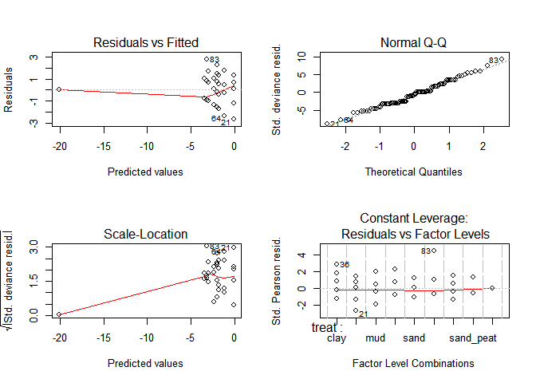
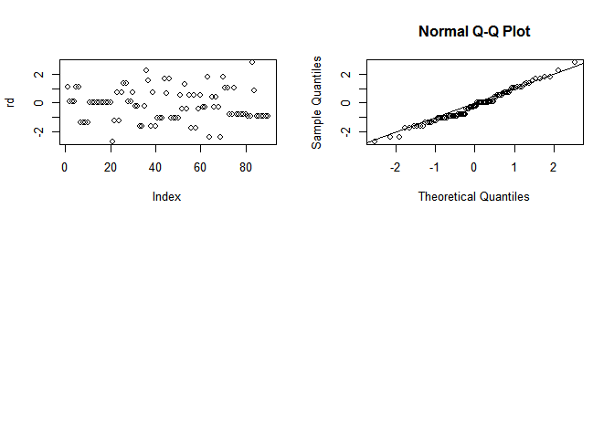

# Litorela
Pavel Jakubec  
13. února 2016  
#Litorela report

```r
data=read.csv ("resubmision/prolicovani_ruzne_substraty_2.csv", header=TRUE, sep=";") 

#explore the data
head(data)
```

```
##   dish succ treat sum fail
## 1   p1    2  sand  10    8
## 2   p2    1  sand  10    9
## 3   p3    1  sand  10    9
## 4   p4    1  sand  10    9
## 5   p5    2  sand  10    8
## 6   p6    2  sand  10    8
```

```r
str(data)
```

```
## 'data.frame':	90 obs. of  5 variables:
##  $ dish : Factor w/ 90 levels "b1","b10","b2",..: 41 43 44 45 46 47 48 49 50 42 ...
##  $ succ : int  2 1 1 1 2 2 0 0 0 0 ...
##  $ treat: Factor w/ 9 levels "clay","control",..: 5 5 5 5 5 5 5 5 5 5 ...
##  $ sum  : int  10 10 10 10 10 10 10 10 10 10 ...
##  $ fail : int  8 9 9 9 8 8 10 10 10 10 ...
```

```r
#put together some model
mod <- glm(cbind(succ, fail) ~ treat, data=data,family=binomial)
mod
```

```
## 
## Call:  glm(formula = cbind(succ, fail) ~ treat, family = binomial, data = data)
## 
## Coefficients:
##    (Intercept)    treatcontrol        treatmud       treatpeat  
##        -1.9924          1.9524          0.8398         -0.9520  
##      treatsand  treatsand_clay   treatsand_mud  treatsand_peat  
##        -0.3212         -1.1856          0.1771         -1.4837  
##   treattopsoil  
##       -18.1260  
## 
## Degrees of Freedom: 89 Total (i.e. Null);  81 Residual
## Null Deviance:	    249.9 
## Residual Deviance: 107 	AIC: 233.1
```

```r
summary(mod)
```

```
## 
## Call:
## glm(formula = cbind(succ, fail) ~ treat, family = binomial, data = data)
## 
## Deviance Residuals: 
##     Min       1Q   Median       3Q      Max  
## -2.6543  -0.9036  -0.1997   0.5192   2.7690  
## 
## Coefficients:
##                 Estimate Std. Error z value Pr(>|z|)    
## (Intercept)      -1.9924     0.3077  -6.475 9.50e-11 ***
## treatcontrol      1.9524     0.3670   5.319 1.04e-07 ***
## treatmud          0.8398     0.3867   2.172   0.0299 *  
## treatpeat        -0.9520     0.5525  -1.723   0.0849 .  
## treatsand        -0.3212     0.4656  -0.690   0.4903    
## treatsand_clay   -1.1856     0.5959  -1.990   0.0466 *  
## treatsand_mud     0.1771     0.4216   0.420   0.6744    
## treatsand_peat   -1.4837     0.6621  -2.241   0.0250 *  
## treattopsoil    -18.1260  1417.4364  -0.013   0.9898    
## ---
## Signif. codes:  0 '***' 0.001 '**' 0.01 '*' 0.05 '.' 0.1 ' ' 1
## 
## (Dispersion parameter for binomial family taken to be 1)
## 
##     Null deviance: 249.93  on 89  degrees of freedom
## Residual deviance: 107.05  on 81  degrees of freedom
## AIC: 233.08
## 
## Number of Fisher Scoring iterations: 17
```

```r
anova(mod, test="Ch")
```

```
## Analysis of Deviance Table
## 
## Model: binomial, link: logit
## 
## Response: cbind(succ, fail)
## 
## Terms added sequentially (first to last)
## 
## 
##       Df Deviance Resid. Df Resid. Dev  Pr(>Chi)    
## NULL                     89     249.93              
## treat  8   142.88        81     107.05 < 2.2e-16 ***
## ---
## Signif. codes:  0 '***' 0.001 '**' 0.01 '*' 0.05 '.' 0.1 ' ' 1
```

```r
#see what is going on with residuals
par(mfrow=c(2,2))
plot(mod)
```



```r
rd=residuals(mod)
plot(rd)
qqnorm(residuals(mod, type="deviance"))
abline(a=0,b=1)
```



```r
#back-transformation of coeficients for each treatment to mean survival probability
plogis (mod$coefficients[1]) #intercept (clay)
```

```
## (Intercept) 
##        0.12
```

```r
plogis (mod$coefficients[1]+mod$coefficients[2]) #control
```

```
## (Intercept) 
##        0.49
```

```r
plogis (mod$coefficients[1]+mod$coefficients[3]) #mud
```

```
## (Intercept) 
##        0.24
```

```r
plogis (mod$coefficients[1]+mod$coefficients[4]) #peat
```

```
## (Intercept) 
##        0.05
```

```r
plogis (mod$coefficients[1]+mod$coefficients[5]) #sand
```

```
## (Intercept) 
##        0.09
```

```r
plogis (mod$coefficients[1]+mod$coefficients[6]) #sand_clay
```

```
## (Intercept) 
##        0.04
```

```r
plogis (mod$coefficients[1]+mod$coefficients[7]) #sand_mud
```

```
## (Intercept) 
##        0.14
```

```r
plogis (mod$coefficients[1]+mod$coefficients[8]) #sand_peat
```

```
## (Intercept) 
##        0.03
```

```r
plogis (mod$coefficients[1]+mod$coefficients[9]) #topsoil
```

```
##  (Intercept) 
## 1.831042e-09
```
THE END
